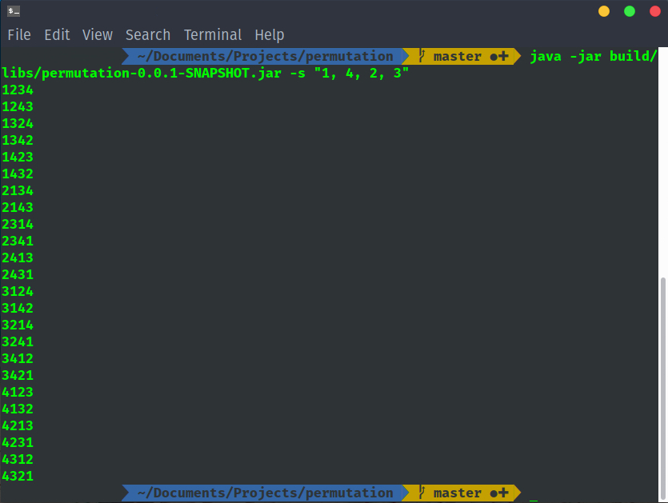

## Tool for generating permutations 

Java implementation of algorithm from Vladimir Kostin's article.\
Links: [edu.ru](http://window.edu.ru/resource/334/24334/files/2003_2_84.pdf), [cyberleninka.ru](https://cyberleninka.ru/article/n/generatsiya-perestanovok).

#### Usage

`java -jar permutation-<version>.jar -f file.txt -ed "|"`

##### Keys:
 - -s  --sequence 
Enter the sequence of symbols, it haves to be in quotes and separated by commas.
Example: `java -jar permutation-<version>.jar -s "A, was, The, first"`
 - -f  --file 
Enter the file name for input.
<b>Only one key (-f or -s) can be used.</b>
 - -o  --output 
Enter the file name for output. \
 Console output by default.
 - -ed --elem_delimiter 
Delimiter for elements in sequence.\
 Empty by default.
 - -pd --perm_delimiter 
Delimiter for every permutation. \
 "\n" by default.
 - -mq --max_quantity 
Sets the max element's quantity in sequence.\
 10 by default.\
 Not recommended sets it more then 10.
 - -h  --help 
Shows help page.
 - -v  --version 
Shows generator's version.

##### Image usage example:
